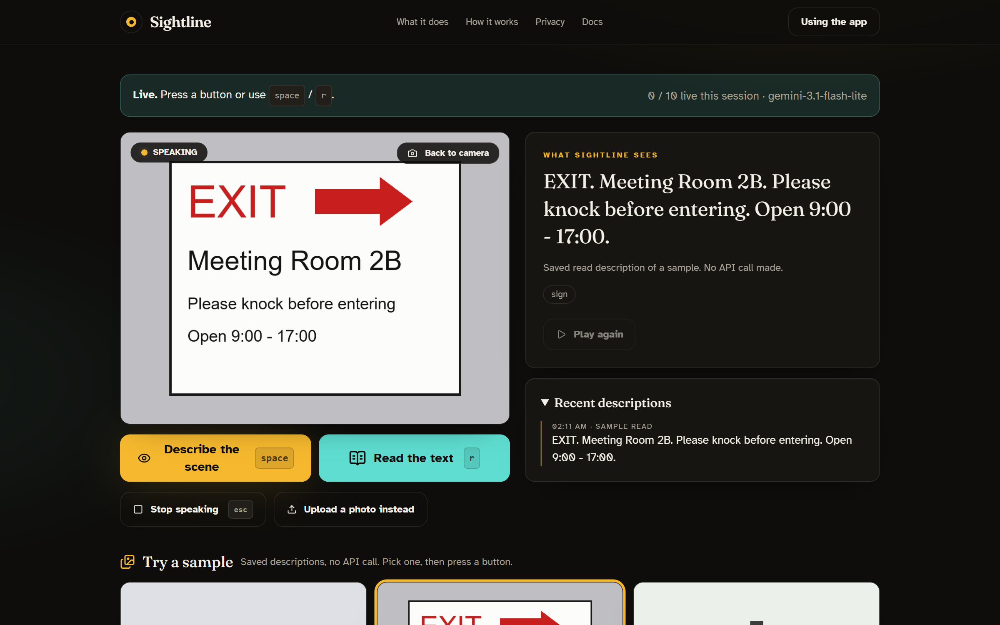

<div align="center">

# 👁️ Sightline

### Hear what your camera sees.

**A webcam scene narrator for people with low vision.**
One press describes what is in front of you, or reads any visible text aloud, word for word.

[**Live demo**](https://sightline-rho-khaki.vercel.app) · [How it works](#how-it-works) · [Setup](#setup) · [Privacy](#privacy-by-design) · [Deploy](#deploy-to-vercel-free-hobby-plan)

[](https://sightline-rho-khaki.vercel.app)


<br/>

Created by **Ali Hadi Meselmani**

[](https://www.linkedin.com/in/alihadimeselmani)
[](https://github.com/AliHadi315)

<br/>

<a href="https://sightline-rho-khaki.vercel.app/app">
  
</a>

</div>

---

Sightline is built for someone who cannot see the screen and wants to know what is on the desk,
what a sign says, or whether the room has changed. Everything it finds is spoken aloud, in plain
language, with directions like *"to your left"* and *"in front of you"*.

## Highlights

| | |
|---|---|
| 🔎 **Scene mode** | "A laptop is open in front of you, a mug to its right." The most important thing first, then layout and what is happening. |
| 📖 **Read mode** | Reads every word in view, top to bottom, exactly as written. Labels, letters, signs, screens. |
| 🔁 **Only what changed** | Remembers the last three descriptions and reports what is new instead of repeating itself. |
| ✋ **Manual capture only** | Nothing is sent until you press a key or a button. No motion detection, no timers, no background watching. |
| 🛡️ **No guessing about people** | Never age, gender, race, or mood. A person is described only by presence and action. |
| ⚡ **Fast and resilient** | Fastest free Gemini Flash model with automatic fallback, text shown the moment it arrives, speech streamed as it is generated. |
| 💸 **Runs on free tiers** | Google AI Studio key, edge-tts speech, Vercel Hobby hosting. No billing account, ever. |

## How it works

1. **Point the camera.** The live view stays in your browser or on your desktop.
2. **Press once.** `space` describes the scene, `r` reads the text. That single frame goes to the model and is forgotten.
3. **Listen.** The answer appears in large type and is spoken automatically. `esc` stops the voice.

Three front ends share one core (`vision.py`, `speech.py`, `memory.py`): a desktop app with a live
camera window, a Gradio interface, and a React website backed by a stateless API that runs as a
serverless function on Vercel.

## Privacy, by design

- **Capture is manual only.** A description happens when you press a key or a button. There is no
  motion detection, no timer, no automatic capture, in either the desktop app or the web demo.
- **No demographic inference.** The model is instructed never to state or guess age, gender, race,
  emotion, health, or any other attribute of a person. People are described only by presence and
  action: "a person seated at a desk".
- **No frame archive.** The desktop app keeps frames in memory and writes only `debug/last_frame.jpg`,
  overwritten on every capture. The web demo writes no frames at all and forgets your API key when the
  request finishes.

## Setup

Everything runs on free tiers: a free Google AI Studio key, free `edge-tts` speech, free Vercel
hosting. No billing account is ever needed.

1. **Get a free Gemini key.** Go to <https://aistudio.google.com/apikey>, sign in with a Google
   account, click *Create API key*. Do not enable Google Cloud Billing and do not use Vertex AI.
2. **Install.**

   ```bash
   python -m venv venv
   venv\Scripts\activate          # Windows;  source venv/bin/activate on macOS / Linux
   pip install -r requirements-desktop.txt   # core + desktop app + Gradio + local server
   ```

   `requirements.txt` alone is the slim set (Gemini, edge-tts, Pillow, FastAPI) that the Vercel
   serverless function installs.

3. **Configure.** Copy `.env.example` to `.env` and paste your key after `GEMINI_API_KEY=`.
4. **Sample images.** `python make_samples.py` draws the three sample images and five eval frames.

The Gemini model is a single constant, `MODEL` in `config.py` (currently `gemini-3.1-flash-lite`,
the fastest free-tier vision model, about 2 s per frame when Google is not congested). If it is
overloaded, hangs, or is rate limited, the call switches automatically to the models in
`FALLBACK_MODELS`; the model actually used is recorded in each log line and API response.
Gemini 1.5 is retired for new keys; keep these on current Flash models.

## Desktop app

```bash
python main.py
```

A window shows the live camera with an FPS counter, the current state
(`IDLE / CAPTURING / THINKING / SPEAKING`), the active mode, and the cooldown timer.

| Key     | Action                                             |
|---------|----------------------------------------------------|
| `space` | Describe the scene                                 |
| `r`     | Read visible text aloud                            |
| `esc`   | Stop speaking immediately and return to idle       |
| `q`     | Quit                                               |

Pipeline per press: grab the current frame, downscale so the longest edge is 768 px, JPEG at
quality 80, write `debug/last_frame.jpg`, send to Gemini, speak the answer. Capture, the API
call, and speech all run on a worker thread, so the preview never stutters. Presses during
processing and presses inside the 3-second cooldown are ignored, with a message on screen.

If the camera cannot be opened, the key is missing, or the network is down, the app prints or
displays a plain message rather than a traceback. Set `CAMERA_INDEX` in `.env` to pick another camera.

## Website

The public site is a small React app in `web/` (Vite, Tailwind, sections adapted from 21st.dev
components) served by `server.py`, which also exposes the JSON API the site uses and mounts the
Gradio interface at `/gradio`.

```bash
cd web && npm install && npm run build && cd ..   # writes web/dist (Vercel builds this itself)
python server.py                                  # http://127.0.0.1:7860
```

Pages: landing (what it does, how it works, privacy, FAQ), `/app` (the tool), `/privacy`, `/docs`,
`/gradio` (classic UI), `/api/docs` (API reference). The app page uses the browser camera, has the
same `space` / `r` / `esc` keys as the desktop app, a photo-upload fallback, the three samples, a
recent-descriptions list, and an own-key field. Frames go to the server only when you press a
button and are never stored. For front-end development run `npm run dev` in `web/`; it proxies
API calls to the Python server.

## Gradio interface

```bash
python app.py
```

Then open <http://127.0.0.1:7860>. This is the plain Gradio version of the same tool, also
reachable at `/gradio` when `server.py` is running. It is built for low vision: large type, high
contrast, big buttons, and spoken output that plays automatically.

- **Use my camera** tab: tap the camera shutter, then press **Describe the scene** or **Read the text**.
  Keyboard: `space` = describe scene, `r` = read text, `esc` = stop the audio.
  A *Recent descriptions* panel keeps the last few results so they can be re-read.
- **Try a sample** tab: three sample images with saved descriptions, no API call, works without a camera or key.
- **Settings** tab: paste your own free AI Studio key to bypass the shared key's limits.
- **About & privacy** tab: who it is for, how it works, the privacy rules, and the free-tier limits.

Keys and limits, in order:

1. `GEMINI_API_KEY` from the environment (on Vercel, a project environment variable; never committed).
2. An optional *your own key* field that overrides the shared key for that request only.
3. A cap of 10 live calls per browser session, and a daily counter for the shared key in
   `logs/daily_count.json` (200 per day, under the free-tier ceiling).

**Demo mode.** When there is no key, the shared key's daily quota is gone, or the session cap is
reached, the demo switches to three sample images in `samples/` with cached descriptions from
`samples/cached.json`, and a banner says why. You can also pick a sample at any time to try the
demo without a camera. The page always does something and never shows an error screen.

### Deploy to Vercel (free Hobby plan)

The site is served statically from `web/dist` and the API runs as one Python serverless function,
`api/index.py`. The API is stateless: the browser sends its own last three descriptions and its
session count with each request, so any instance can answer. `vercel.json` wires it all up.

1. Install the CLI and log in: `npm i -g vercel`, then `vercel login`.
2. From the project root:

   ```bash
   vercel            # preview deployment, prints a URL
   vercel --prod     # production deployment
   ```

3. In the Vercel project, *Settings → Environment Variables*, add `GEMINI_API_KEY` and redeploy.
   Without it the site runs in demo mode only.

Notes: the free plan allows 60 s per function call, which covers the slowest fallback chain. The
daily counter is per instance on serverless, so it is best-effort there; the per-session cap is
what bounds usage. The Gradio UI is not deployed (it needs a long-running process); it stays
available locally at `/gradio`. Hugging Face Spaces was the original target, but Gradio Spaces on
the free CPU tier now require a paid plan.

## Free-tier limits and what the app does at them

The AI Studio free tier allows roughly 10 to 15 requests per minute and a few hundred per day on
Flash models. Sightline is built to hit those limits gracefully:

- A **3-second cooldown** between triggers, shown on screen.
- On a **429 rate limit**, the call is retried with exponential backoff (1 s, then 2 s) on the
  fallback models. If it still fails, the app says "Rate limit reached, try again in a moment".
- On **503 / 504 overload or a hung request** (15-second timeout), the call switches to the next
  model immediately instead of waiting, so a bad day at Google costs seconds, not a minute.
- When the **daily quota** is exhausted, the desktop app shows a persistent red banner and stops
  calling Gemini; the web demo switches to demo mode.
- A **malformed response** is never fatal: it degrades to a best-effort description or "No change".
- If the description is empty or nearly identical to the previous one, speech is skipped and the app
  shows **No change**.

## Speech: edge-tts is unofficial

Speech uses [`edge-tts`](https://github.com/rany2/edge-tts), an unofficial client for Microsoft
Edge's Read Aloud service. Microsoft does not support it and may change or block it at any time.
Every synthesis call is wrapped: if it fails, the description is still shown as text and the app
says speech is unavailable. If speech stops working, first try `pip install -U edge-tts`.

## Evals

```bash
python run_evals.py --sleep 5
```

Runs the current scene prompt over every frame listed in `evals/expected.json`, checks that each
required object (or one of its `|`-separated synonyms) appears in the description or object list,
and prints a per-frame PASS/FAIL table plus a percentage. The score and per-frame details are
written to `evals/results.json`. `--sleep` (default 5 s) keeps a full run inside the per-minute limit.

To add a frame: put the image in `evals/frames/` and add `"name.jpg": ["object", "other|synonym"]`
to `evals/expected.json`.

## Logging

Every Gemini call appends one line to `logs/log.jsonl`: ISO timestamp, mode, latency in ms, token
counts when reported, the raw response, and any error. It is local only and gitignored. Read it with
`jq . logs/log.jsonl`.

## Layout

```
config.py       MODEL, VOICE, thresholds, .env loading
vision.py       Gemini calls, prompts, response schema, retry/backoff, JSONL logging
speech.py       edge-tts synthesis to mp3
memory.py       last-3 memory, change detection, repetition suppression
main.py         desktop app: OpenCV loop, hotkeys, worker thread, pygame playback
app.py          Gradio UI, imports vision/speech/memory unchanged
api/index.py    stateless JSON API (FastAPI); the Vercel serverless function
server.py       local server: API + web/dist + the Gradio UI at /gradio on one port
web/            React site (Vite + Tailwind); web/dist is the built output
vercel.json     Vercel build and routing config
run_evals.py    eval harness
make_samples.py draws the sample and eval images
samples/        3 sample images + cached.json for demo mode
evals/          expected.json + frames/
```

`vision.py`, `speech.py`, and `memory.py` import nothing from OpenCV, pygame, or Gradio. That
boundary is what lets both front ends share one core.
